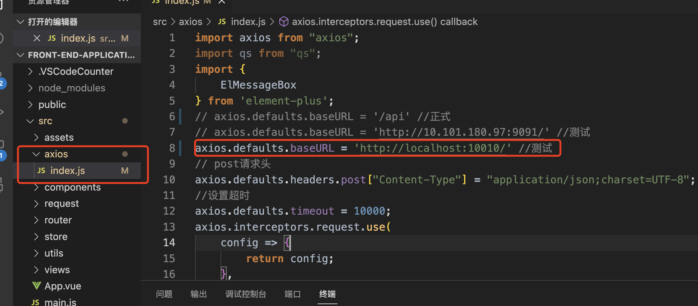

# 前台应用平台

## 依赖安装

```
npm install or cnpm intall
建议使用node v16.xx.x
其他版本有报错可自行解决
```

> node版本管理工具nvm 
>
> Mac安装介绍：http://t.csdnimg.cn/JmC7A
>
> windows可自行搜索

## 配置文件修改



## 启动&打包

```bash
npm run dev #启动
npm run build #打包
```

## 